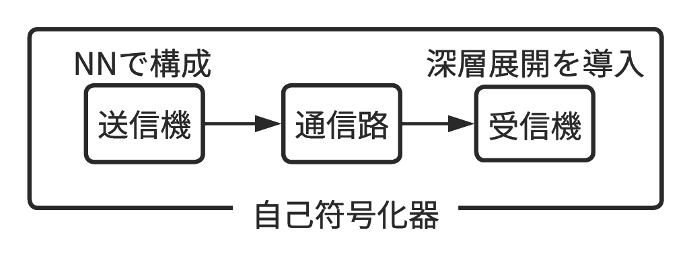

# MIMO PDA Autoencoder (NN Modulator + Deep-Unfolded PDA)

## 概要

End-to-end learning of a MIMO transmitter/receiver as an autoencoder — NN-based constellation shaping + deep-unfolded PDA with trainable ASB scaling.

本リポジトリは、**MIMO 通信路**の繰り返し信号検出 **(PDA: Probabilistic Data Association)** を対象に、

- **変調器**: **ニューラルネットワーク (NN: Neural Network)** による信号点配置のデータ駆動設計
- **検出器**: PDA に **深層展開 (DU: Deep Unfolding)** を適用し、**[ASB][TakahashiIEEE] (Adaptively Scaled Belief)** のスケーリング係数を学習

を通信系全体の**自己符号化器 (autoencoder)** として end-to-end 最適化するための計算機シミュレーションコードです。
研究詳細は[技報 (IEICE)][MyPaper] をご参照ください。



## 特徴

- レイリーフェージング MIMO 通信路を想定
- 変調器は **QAM / NN** を選択可能
- 検出器は **PDA / PDA-ASB / PDA-DU** を選択可能
- 学習経過を可視化
  - loss 等の推移
  - 信号点配置
- テスト結果をグラフ表示
  - ビット誤り率 (BER) 特性
  - シンボル誤り率 (SER) 特性

## 動作環境

- 必須
  - Python 3.x
  - NumPy
  - PyTorch

- 可視化・ノートブック実行用
  - matplotlib
  - Jupyter

```bash
pip install numpy torch matplotlib
```

## 使い方

1. 依存関係を導入（上記）
2. Jupyter で `main.ipynb` を開いて上から実行

### シミュレーションの流れ

1. **設定**: `SIM`（設定用オブジェクト）に設定パラメータを入れる
2. **事前学習**: 検出器に MMSE (Minimum Mean Square Error) を用いた学習で NN 変調器の初期配置を安定化（NN 変調器を選択した場合）
3. **本学習**: end-to-end 学習（NN 変調器または PDA-DU 検出器を選択した場合）
4. **テスト**: 設定した各 $E_\mathrm{s} / N_0$ に対して BER と SER を算出

補足:

- `main.ipynb` には Google Colab を想定した Drive マウント処理が含まれています。Google Colab で実行する際はパスを調整してください。

## 設定パラメータ (`SIM`)

<details><summary>表示</summary>

### 学習 / テスト 共通設定

| パラメータ名 | 意味 |
| - | - |
| `use_nnmod` | `True`: NN 変調器 / `False`: QAM |
| `ASB_mode` | `"none"`: PDA / `"ASB"`: PDA-ASB / `"DU"`: PDA-DU |
| `M`, `N` | 送信・受信アンテナ本数 |
| `Q_ant` | アンテナあたりの変調多値数 |
| `Kd` | データフレーム長 |
| `num_joint_ant` | NN 変調時および信号検出時のアンテナ結合本数 |
| `niter_PDA` | PDA 反復回数 |
| `d1`, `d2` | ASB 係数の調整パラメータ (PDA-DU の初期値) |
| `env_server` | `True`: 並列処理あり / `False`: 並列処理なし |
| `nworker` | 並列ワーカー数 |

<details><summary><code>Q_ant</code> の詳細</summary>

`use_nnmod=False` の場合、 $2$ または $4^n$ ($n$ は任意の自然数) で指定可能。`use_nnmod=True` の場合は $2$ 以上の任意の自然数で指定可能。

</details>

<details><summary><code>num_joint_ant</code> の詳細</summary>

現在 `0.5`, `1` のみ指定可能

- `0.5`: シンボルの実部（同相成分）と虚部（直交成分）を別々に検出する。NN変調器の場合、格子状の信号点配置になる。
- `1`: シンボルの実部と虚部を合わせて検出する。NN変調器の場合、非格子状の信号点配置になる。

</details>

### 学習設定

| パラメータ名 | 意味 |
| - | - |
| `epochs`, `mbs` | エポック数、ミニバッチ数 |
| `EsN0_train` | 学習時 $E_\mathrm{s} / N_0 \ [\mathrm{dB}]$ (単一値または1次元配列) |
| `hidden_depth`, `hidden_dim` | 変調器の隠れ層 (中間層) の深さ・次元 |
| `ind_cons` | 各送信アンテナがもつ NN 変調器の信号点配置の独立性<br>`True`: 独立 / `False`: 同一 |
| `lr_mod`, `lr_det` | 変調器 / 検出器の学習率 |
| `drop_start_mod`, `drop_start_det` | 変調器 / 検出器のスケジューラの開始エポック |
| `drop_factor_mod`, `drop_factor_det` | 変調器 / 検出器のスケジューラの学習率減衰係数<br>減衰係数は 1 エポック毎に乗算 |

### テスト設定

| パラメータ名 | 意味 |
| - | - |
| `EsN0_test` | テスト時 $E_\mathrm{s} / N_0 \ [\mathrm{dB}]$ の1次元配列 |
| `nloop_max` | $E_\mathrm{s}/N_0$ 毎の最大シミュレーション回数 |
| `SE_max` | $E_\mathrm{s} / N_0$ 毎のシンボルエラー数の上限 (この値に達すると早期終了) |

<details><summary><code>nloop_max</code> と <code>SE_max</code> の補足</summary>

- 早期終了させない場合は `SE_max=float('inf')` に設定すること
- シンボルエラー数が `SE_max` に達するまで計算を継続する場合は `nloop_max=float('inf')` に設定すること
- `nloop_max` と `SE_max` の両方を `float('inf')` に設定すると計算が終了しないため、どちらかは有限値に設定すること

</details>

</details>

## 参考文献

- [IEICE 技報（研究会発表）][MyPaper]
- [ASB (Adaptively Scaled Belief) に関する先行研究][TakahashiIEEE]

## ライセンス

MIT License

[MyPaper]: https://www.ieice.org/publications/ken/summary.php?contribution_id=128665&society_cd=CS&ken_id=CS&year=2024&presen_date=2024-01-18&schedule_id=8121&lang=jp&expandable=1
[TakahashiIEEE]: https://ieeexplore.ieee.org/abstract/document/8543847
